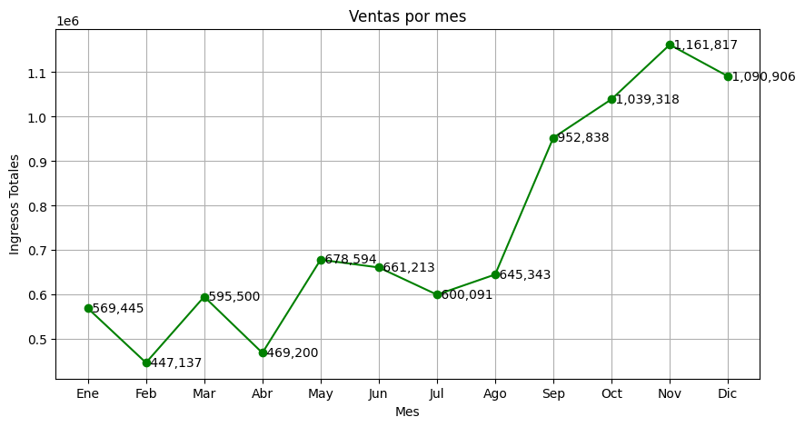

# Análisis de Comportamiento de Clientes en E-commerce 🛍️

## Resumen del Proyecto
Este proyecto analiza un conjunto de datos de una tienda minorista en línea del Reino Unido para identificar patrones de compra, segmentar clientes y descubrir los productos más vendidos. El objetivo es extraer información valiosa que pueda guiar decisiones de negocio, como campañas de marketing dirigidas y gestión de inventario.

---

## Dataset
Los datos utilizados provienen del dataset "E-Commerce Data" disponible en Kaggle. Contiene transacciones ocurridas entre 2010 y 2011.
* **Fuente:** [Kaggle E-Commerce Dataset](https://www.kaggle.com/datasets/carrie1/ecommerce-data)

---

## Herramientas Utilizadas
* **Lenguaje:** Python
* **Librerías:** Pandas (para manipulación de datos), Matplotlib y Seaborn (para visualización de datos).

---

## Proceso de Análisis
1.  **Limpieza de Datos:** Se manejaron valores nulos en `CustomerID`, se eliminaron registros con cantidades negativas y se corrigieron los tipos de datos (ej. `InvoiceDate` a datetime).
2.  **Ingeniería de Características (Feature Engineering):** Se crearon nuevas columnas como `TotalPrice`, `Month`, `Hour` y `DayOfWeek` para facilitar el análisis temporal.
3.  **Análisis Exploratorio de Datos (EDA):** Se investigaron las preguntas clave del negocio mediante agrupaciones y agregaciones para entender el comportamiento de los datos.

---

## Resultados Clave 📈
* **Pico de Ventas:** Noviembre es el mes con mayores ingresos, probablemente debido a las compras pre-navideñas.
* **Productos Estrella:** Los productos de decoración del hogar y los artículos para fiestas son los más vendidos en términos de cantidad.
* **Principal Mercado:** La gran mayoría de los clientes (más del 90%) se encuentran en el Reino Unido.

---

## Visualizaciones

### Ventas Totales por Mes

### Top 10 Productos Más Vendidos

*(Aquí puedes añadir más de tus gráficos...)*

---

## Cómo Ejecutar este Proyecto
1.  Clonar el repositorio: `git clone https://github.com/TU_USUARIO/Analisis-Ventas-Ecommerce-Python.git`
2.  Instalar las dependencias: `pip install -r requirements.txt`
3.  Ejecutar el script: `python caso.py`
